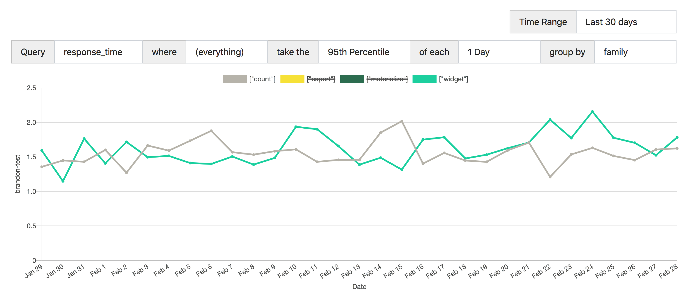
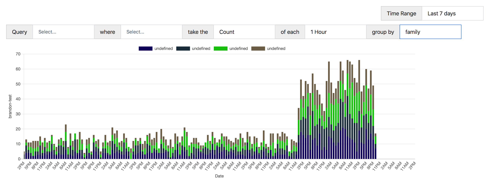

# Eventrist

My own 80/20 implementation of what I keep wanting from an online event data analysis system.

Uses influxDB as an event store (not _totally_ scalable but will work great for up to ~10,000 events per day) with a thin API on top that accepts and records, and indexes arbitrary JSON as events. Includes a basic UI with nice graphing capability and an easy to use querying method that should cover most use cases people would need from time-based event metrics.

Stack is currently Docker, InfluxDB, Starlette, Svelte, and Chart.JS.

Not deployed to the intertubes yet but will be soon.

A lot more features to come (none are that hard), including but not limited to:
  - zooming and custom ranges
  - ability to group by multiple tags
  - more/nicer autocomplete
  - easy view of raw events when needed

## Samples

Here's what it looks like so far (dummy data):

